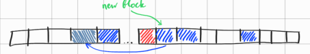
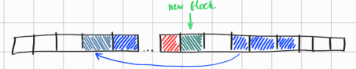

Flash has two main problems:  
1 - finite number of writes per sector;  
2 - bit rot.

Since programs operating Phraser BlockDB can also run on microcontrollers, writing data/blocks directly to the built-in Flash,
both of these problems arise. Unlike SSDs, which have built-in firmware functions to extend the lifespan of flash,
microcontrollers typically use the simplest scheme with direct access to flash. Thus, on microcontrollers (e.g., RP2040),
there is no automatic background process that moves data around, trying to evenly distribute the wear of individual sectors
while simultaneously preventing bit rot through constant copying.

Since such refinements are not found on microcontrollers, and understanding how much the life of an individual device can be
extended if similar approaches are applied to evenly distribute the write load and regularly copy data, PhraserDB was imagined
as a flash-friendly data structure from the get-go. To maximize the lifespan of flash, two techniques were applied:

### 1. Append-only write
We never overwrite the same sector multiple times in a row; instead, the area of flash allocated for PhraserDB is used as a circular
buffer, in which we continuously write new and updated blocks to the "end" of this buffer. To understand which block is currently
valid, continuous versioning of blocks is used, with the version monotonically increasing.  
Thus, among blocks with the same blockId, the one with the highest version is considered valid. All its previous versions are
considered outdated, and updates of other blocks can be written in their place if needed.

### 2. Complementary block copying (a.k.a. Throwback)
Thus, the "end" of our circular buffer is the block with the highest version - i.e., the last change in the database. When a new
update or new data comes in, we want to write it to the first found free/obsolete block "to the right" of the last block. I put
the word "to the right" in quotes because we are talking about a circular buffer, where the concepts of "right" and "left" do not
always correspond to the absolute positions of the blocks.  
The essence of complementary copying of additional blocks is to copy not only frequently changing blocks but also other blocks, some
of which may change much less often; since infrequent copying can cause two problems:
1. Bit rot of the sector where such a block is located.
2. Uneven wear of other blocks that receive writes much more frequently.

Since we are talking about microcontrollers, we would like to have a minimal and simplest algorithm that, at the same time, can address
these problems. Therefore, we propose a few simple rules, following which allows for easy and quick selection of a complementary block
for copying, deciding where to copy it, and before writing the main changes, performing complementary copying to minimize the
aforementioned problems. One downside of this approach is that we get a stable 2x write amplification, but considering the simplicity of
the approach and the sufficiently uniform distribution of writes, as well as bit rot prevention properties, the compromise seems acceptable
for microcontrollers. It is also worth noting that in this case, we see Phraser as a read-heavy system.  
Another downside is that if there are no writes at all, bit rot is still possible, but we accept this since we want to reduce complexity
to an absolute minimum (without using background tasks).

Let’s describe the algorithm for complementary block copying.  
For each new write:
1. Find the last block (block_1), i.e., the block with the maximum/latest version.
2. Find the next valid block "to the right" of `block_1` (block_2).
3. Find the next obsolete or empty block "to the left" of `block_1` (block_3).
- Now copy `block_2` to the place of `block_3`, updating the version in the process.
- Next, continue with the main write:
4. Find the next obsolete or empty block "to the right" of `block_1` (block_4).
- After that, our main update is written to `block_4` with the latest version.

Note that if `block_2` was located immediately after `block_1`, then after writing its updated version to `block_3`, 
`block_2` itself becomes obsolete.
Thus, there is a guarantee that the block located immediately "to the right" of `block_1` at the time of writing of the main update will always
be either empty or obsolete, and therefore the main update will always go to the block located immediately "to the right" of `block_1`.
Which means, the last block always shifts exactly one sector "to the right."  
Thus, by using complementary block copying, we not only gain protection against bit rot but also achieve an ideal round-robin and a uniform
distribution of writes across sectors that is close to perfect.  

This can be visualized as follows:

1. The block located immediately "to the right" of `block_1` is valid.

2. The block located immediately "to the right" of `block_1` is obsolete.

Another useful property of this process is that we're creating 'backups' of data by duplicating the current block data
to other blocks with new versions. Thus, if the latest version of a block gets corrupted, and it's no longer possible to
validate it by checksum, there is a significant probability that its previous version would still contain the same latest
data, if it was created by the process of complementary block copying (throwback). This adds another layer of resilience and
fault tolerance to the overall structure.

Java implementation:  
`com.phraser.runtimedb.DbRuntime.updateBlock`