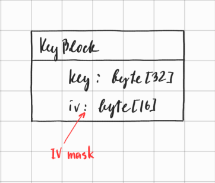

# Шифрование БД в Phraser

Рассмотрим, как шифрование БД работает в Phraser.

## 1. Шифрование блоков

Блоки шифруются при помощи алгоритма AES-256 CBC.

1. Концепция `IV Mask`.  
Для каждого блока мы используем уникальное значение `IV`.  
Данное значение вычисляется путем XOR-инга двух частей: `IV Part` и `IV Mask`.  
`IV Part` содержится в 16-байтном футере блока, и является уникальным для каждого блока.  
Значение `IV Mask` зависит от типа блока, и описано ниже.

2. Шифрование `KeyBlock`.  
`KeyBlock` это особый вид блока, в котором содержится главный `Key` и главная `IV Mask`, которые используются 
для шифрования всех остальных блоков, за исключением самого `KeyBlock`.  
Сам же `KeyBlock` шифруется ключом, вычисляемым из _MasterPassword_ при помощи алгоритма PBKDF2 (`KeyBlock key`), а в качестве 
`IV Mask` мы используем константное значение, соответствующее значению функции md5 от строки 
"PhraserPasswordManager".

3. Шифрование прочих блоков.  
Как уже было сказано, для шифрования иных блоков (кроме `KeyBlock`) мы используем главный `Key` и главную `IV Mask`,
которые получаем из `KeyBlock`.

## 2. Структура блоков

Структура зашифрованного блока имеет следующий вид:

- "Внешний слой" (на схеме сверху) состоит из 2х частей - 16 байт в футере составляют IV Part, а весь остальной блок зашифрован способом, 
описанным выше.
- После расшифровки основной части, в последних 4 байтах расшифрованного буфера мы найдем значение функции контрольной 
суммы Adler32, вычисленное от предыдущих байтов - это позволяет проверить блок на целостность после расшифровки (в нижней части схемы).
- При этом после расшифровки байты расположены перед контрольной суммой в обратном порядке. Если мы посмотрим на структуру данных, то 
увидим, что хвост неиспользуемых байтов заполнен случайными значениями. Таким образом, когда мы разворачиваем эту 
последовательность в обратном порядке, случайные байты перемещаются в начало буфера, и это не позволяет гипотетическому 
криптовзломщику базировать аналитику на возможных значениях хедера блока.
- После расшифровки и проверки контрольной суммы блока эти байты необходимо развернуть обратно для чтения.

## 3. Порядок расшифровки БД

Из вышесказанного можно понять, что порядок расшифровки БД будет следующим:

1. Запрашиваем у пользователя _Master Password_, и вычисляем ключ для расшифровки `KeyBlock`, используя алгоритм PBKDF2.
2. Далее, нам необходимо прочитать все блоки БД для нахождения последней версии `KeyBlock`. При этом мы используем 
вычисленный на предыдущем шаге ключ (`KeyBlock key`) и константную `IV Mask` для их расшифровки.
3. Если нам не удалось найти `KeyBlock`, мы не можем загрузить БД. Такое может произойти, например, если 
MasterPassword неправильный.
4. Далее, из `KeyBlock` мы получаем главный `Key` и главную `IV Mask`.
5. Снова проходим по всем блокам БД, теперь уже пытаясь расшифровать их с помощью главного `Key` и главной `IV Mask`.
6. При этом заполняем данными из блоков кеши и индексы БД.
7. БД готова к использованию! 
